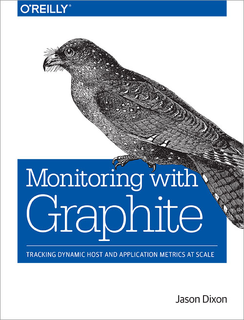

!SLIDE subsectionnonum
#~~~SECTION:MAJOR~~~.~~~SECTION:MINOR~~~ Information Resources

!SLIDE
# Information Resources

Keep informed!

* Documentation
* GitHub projects
* Social Media
* StackExchange
* IRC channel
* Meetups and Conferences (e.g. GrafanaCon)

~~~SECTION:handouts~~~
****

Docs: http://graphite.readthedocs.org/en/latest/ 
StackExchange: http://stackexchange.com/filters/27311/graphite 
IRC channel: http://irc.netsplit.de/channels/details.php?room=%23graphite&net=freenode 
GitHub projects: https://github.com/graphite-project

~~~ENDSECTION~~~

!SLIDE
# Graphite Book

