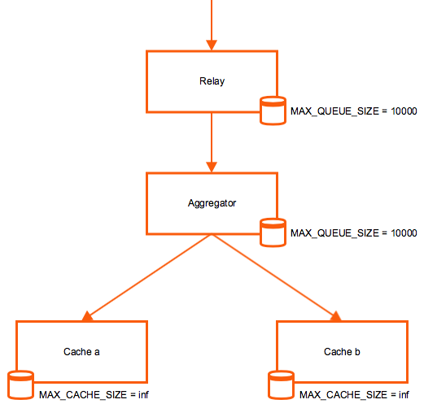

!SLIDE subsectionnonum
#~~~SECTION:MAJOR~~~.~~~SECTION:MINOR~~~ Single-Node Cluster

!SLIDE noprint
# Graphite Single-Node Cluster

In this scenario Carbon Relay distributes metrics over 2 Carbon Caches. As the communication between all Carbon daemons, they all can be located on different hosts.

!SLIDE printonly
# Graphite Single-Node Cluster

In this scenario Carbon Relay distributes metrics over 2 Carbon Caches. As the communication between all Carbon daemons, they all can be located on different hosts.

!SLIDE small
# Multiple Carbon Caches

All Carbon daemons are configured in **carbon.conf** where each daemon gets its own section.

Configure multiple caches in **/opt/graphite/conf/carbon.conf**:

    @@@Sh
    [cache]
    LINE_RECEIVER_PORT = 2023 
    PICKLE_RECEIVER_PORT = 2024
    CACHE_QUERY_PORT = 7002

    [cache:b]
    LINE_RECEIVER_PORT = 2123   # default: 2103
    PICKLE_RECEIVER_PORT = 2124 # default: 2104
    CACHE_QUERY_PORT = 7102

!SLIDE small
# Carbon Cache Service Unit for additional instance

File: **/etc/systemd/system/carbon-cache-b.service**

    @@@Sh
    [Unit]
    Description=Graphite Carbon Cache (instance b)
    After=network.target

    [Service]
    Type=forking
    StandardOutput=syslog
    StandardError=syslog
    ExecStart=/opt/graphite/bin/carbon-cache.py \
      --instance=b \
      --config=/opt/graphite/conf/carbon.conf \
      --pidfile=/var/run/carbon-cache-b.pid \
      --logdir=/var/log/carbon/ start
    ExecReload=/bin/kill -USR1 $MAINPID
    PIDFile=/var/run/carbon-cache-b.pid

    [Install]
    WantedBy=multi-user.target

!SLIDE small
# Start Carbon Cache Daemon for additional instance 

Start Carbon Cache daemon for instance "b" with systemd:

    @@@Sh
    # systemctl daemon-reload
    # systemctl start carbon-cache-b.service
    # systemctl enable carbon-cache-b.service

!SLIDE small
# Carbon Relay with Multiple Caches

Add Carbon Cache instances to Relay configuration in **carbon.conf**:

    @@@Sh
    [relay]
    LINE_RECEIVER_PORT = 2003
    PICKLE_RECEIVER_PORT = 2004

    RELAY_METHOD = consistent-hashing
    REPLICATION_FACTOR = 1

    DESTINATIONS = 127.0.0.1:2024:a, 127.0.0.1:2124:b # former: 127.0.0.1:2014

Restart Carbon Relay:

    @@@Sh
    # systemctl restart carbon-relay.service

!SLIDE noprint
# Graphite Single-Node Cluster with Graphite-Web

!SLIDE printonly
# Graphite Single-Node Cluster with Graphite-Web

!SLIDE small
# Graphite-Web with Multiple Caches

Graphite-Web needs to be configured to query both Carbon Caches.

File: **/opt/graphite/webapp/graphite/local_settings.py**:

    @@@Sh
    CARBONLINK_HOSTS = ["127.0.0.1:7002:a", "127.0.0.1:7102:b"]

Restart Apache:

    @@@Sh
    # systemctl restart httpd.service

!SLIDE noprint
# Graphite Single-Node Cluster with Aggregator

!SLIDE printonly
# Graphite Single-Node Cluster with Aggregator

!SLIDE small
# Carbon Relay with Aggregator

Change Relay configuration in **carbon.conf**:

    @@@Sh
    [relay]
    LINE_RECEIVER_PORT = 2003
    PICKLE_RECEIVER_PORT = 2004

    RELAY_METHOD = consistent-hashing # only with 1 Aggregator
    REPLICATION_FACTOR = 1

    DESTINATIONS = 127.0.0.1:2014 # former: 127.0.0.1:2024:a, 127.0.0.1:2124:b

Restart Carbon Relay:

    @@@Sh
    # systemctl restart carbon-relay.service

!SLIDE small
# Carbon Aggregator with Multiple Caches

Change Aggregator configuration in **carbon.conf**:

    @@@Sh
    [aggregator]
    LINE_RECEIVER_PORT = 2013
    PICKLE_RECEIVER_PORT = 2014

    FORWARD_ALL = True

    DESTINATIONS = 127.0.0.1:2024:a, 127.0.0.1:2124:b # former: 127.0.0.1:2024

    REPLICATION_FACTOR = 1

Restart Carbon Aggregator:

    @@@Sh
    # systemctl restart carbon-aggregator.service

**Note:** The configuration for the Carbon Caches remains unchanged.

!SLIDE noprint
# Metric routing of Carbon Aggregator

The Aggregator does not have the same complement of routing methods as the Relay and supports only `consistent-hashing`. For `rule-based` routing an additional Relay beetwen Aggregator and Cache(s) is needed.

!SLIDE printonly
# Metric routing of Carbon Aggregator

The Aggregator does not have the same complement of routing methods as the Relay and supports only `consistent-hashing`. For `rule-based` routing an additional Relay beetwen Aggregator and Cache(s) is needed.

!SLIDE noprint
# Queues and Caches

Each Carbon daemon will start dropping or not accepting metrics if its queue or cache is full. The parameters `MAX_QUEUE_SIZE` and `MAX_CACHE_SIZE` are configured in **carbon.conf** in the proper section.

!SLIDE printonly
# Queues and Caches

Each Carbon daemon will start dropping or not accepting metrics if its queue or cache is full. The parameters `MAX_QUEUE_SIZE` and `MAX_CACHE_SIZE` are configured in **carbon.conf** in the proper section.

!SLIDE small
# Carbonate

Carbonate brings some usefull tools to handle different tasks in Graphite clusters, for example to redistribute datapoints manually when new nodes are introduced.

    @@@Sh
    # pip install carbonate

The configuration of Carbonate is done in: **/opt/graphite/conf/carbonate.conf**

    @@@Sh
    [main]
    DESTINATIONS = 127.0.0.1:2024:a, 127.0.0.1:2124:b
    REPLICATION_FACTOR = 1
    SSH_USER = carbonate # optional

!SLIDE small
# Carbonate Tools

Tool                  | Description
--------------------- | -------------
**carbon-hosts**      | Return the addresses for all nodes in a cluster
**carbon-list**       | List the metrics this carbon node contains
**carbon-lookup**     | Lookup where a metric lives in a carbon cluster
**carbon-path**       | Transform metric paths to (or from) filesystem paths
**carbon-sieve**      | Given a list of metrics, output those that belong to a node
**carbon-stale**      | Find and list potentially stale metrics
**carbon-sync**       | Sync local metrics using remote nodes in the cluster
**whisper-aggregate** | Set aggregation for whisper-backed metrics this carbon instance contains
**whisper-fill**      | Backfill datapoints from one whisper file into another

~~~SECTION:handouts~~~

****

Project: https://github.com/graphite-project/carbonate

~~~ENDSECTION~~~
