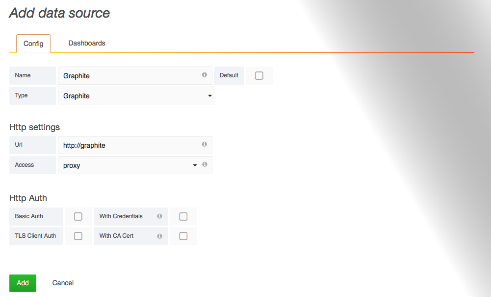
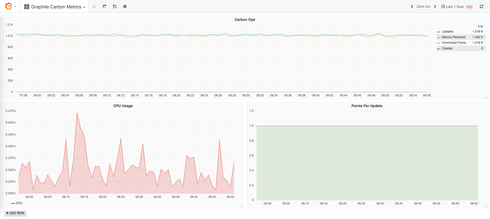

!SLIDE subsectionnonum
#~~~SECTION:MAJOR~~~.~~~SECTION:MINOR~~~ Grafana

!SLIDE smbullets
# Grafana

Grafana is an Open Source webinterface that lets you visualize data from a lot of different data sources. Currently offical supported data sources are Graphite, Elasticsearch, CloudWatch, InfluxDB, OpenTSDB and Prometheus.

Since version 2.0 Grafana ships with its own backend server and since 3.0 additional data sources can be installed as plugins and mixed in the same chart. 

* Visualize graphs
* Create dashboards
* Share
* Annotations
* Templates
* Multiple backends

~~~SECTION:handouts~~~

****

Project: http://grafana.org 
Docs: http://docs.grafana.org

~~~ENDSECTION~~~

!SLIDE small
# Grafana Installation

On RPM-based Linux systems like CentOS, Grafana can be installed via source, YUM repository or using YUM directly:

    @@@Sh
    # yum install https://s3-us-west-2.amazonaws.com/\
    grafana-releases/release/grafana-4.3.1-1.x86_64.rpm

Start the Grafana server:

    @@@Sh
    # systemctl enable grafana-server.service --now

After that Grafana should be accessible via HTTP on port 3000 and the administrative user `admin` with password `admin`.

!SLIDE noprint
# Grafana Data Source

The first step after installation is to add a data source:

!SLIDE printonly
# Grafana Data Source

The first step after installation is to add a data source:

!SLIDE noprint
# Import Grafana Dashboards

You can either create dashboards by yourself or import them from https://grafana.com/dashboards. A good start with Graphite as backend is a dashboard provided from the main developer of Grafana, Torkel Ödegaard, called "Graphite Carbon Metrics" with ID "43".

!SLIDE printonly
# Import Grafana Dashboards

You can either create dashboards by yourself or import them from https://grafana.com/dashboards. A good start with Graphite as backend is a dashboard provided from the main developer of Grafana, Torkel Ödegaard, called "Graphite Carbon Metrics" with ID "43".

!SLIDE
# Build Custom Grafana Dashboards

To build your own dashboards with Grafana you should start with the "Getting started" chapter of the official documentation, available at: http://docs.grafana.org/guides/getting_started/

There's also a video with a 10min beginners guide from Torkel Ödegaard and many other assistances available.
