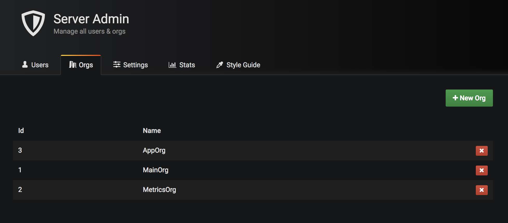
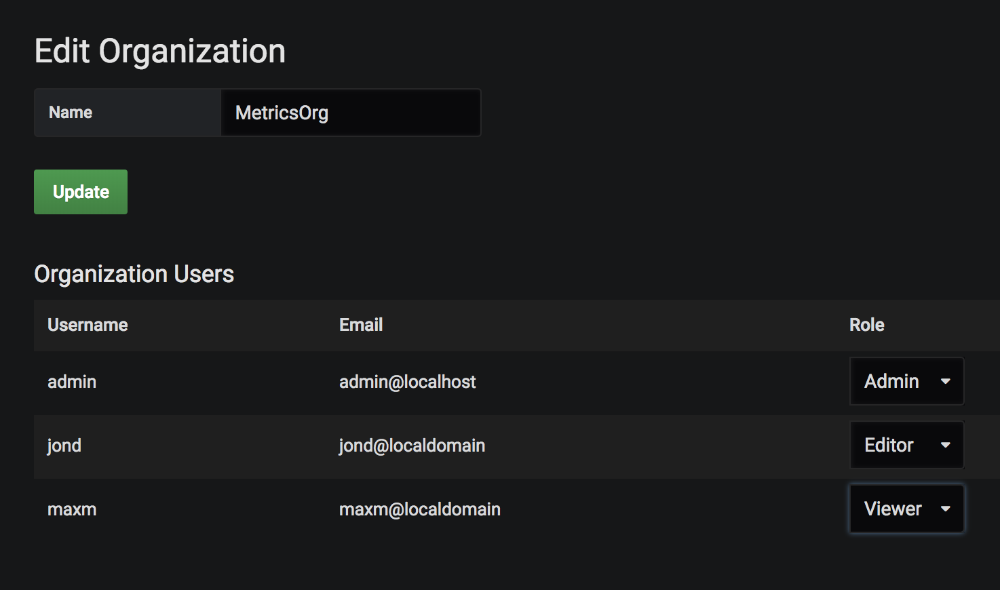
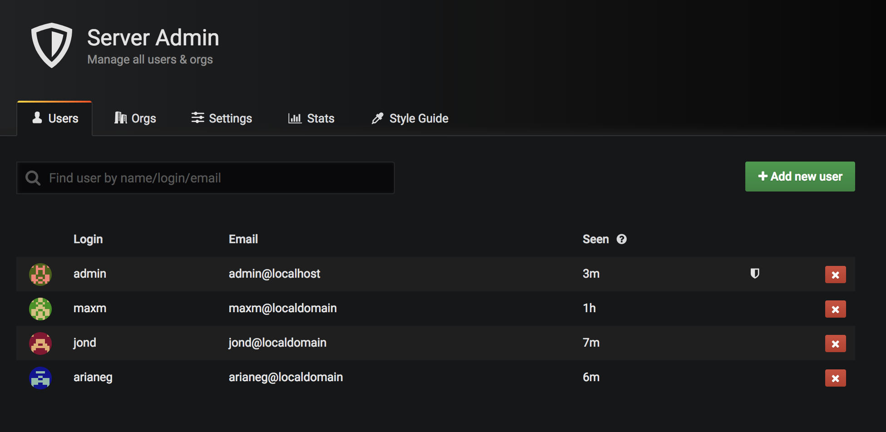

!SLIDE subsection
# ~~~SECTION:MAJOR~~~ Roles and Permissions

!SLIDE noprint
# Organizations

Users can belong to multiple organizations where they're part of one role.

The role defines what users are allowed to do in the GUI.

!SLIDE printonly
# Organizations

Users can belong to multiple organizations where they're part of one role.

The role defines what users are allowed to do in the GUI.

!SLIDE noprint
# Roles

For every organization users can obtain one type of role **admin**, **editor** and **viewer**.

**Admins** can add or edit datasources and user/team permissions.

**Editors** are only allowed to create and modify dashboards and alert rules.

**Viewers** can view any dashboard within his organization.

!SLIDE printonly
# Roles

For every organization users can obtain one type of role **admin**, **editor** and **viewer**.

**Admins** can add or edit datasources and user/team permissions.

**Editors** are only allowed to create and modify dashboards and alert rules.

**Viewers** can view any dashboard within his organization.

!SLIDE noprint
# Users

Users can be invited via email or created manually and added to an organization.

In addition to the organization, users can be part of a team and inherit its permissions.

!SLIDE printonly
# Users

Users can be invited via email or created manually and added to an organization.

In addition to the organization, users can be part of a team and inherit its permissions.

!SLIDE
# Permissions

**Grafana Admin** is the superuser of Grafana, this user is allowed to configure
everything in every organization.

Every other user has a default permission (**organization role**) set in which he is allowed to see everything
at his organization.

**The highest permission always wins!**

To reduce permissions on dashboards, we need to remove the **organization role** based
permissions from the dashboard.
