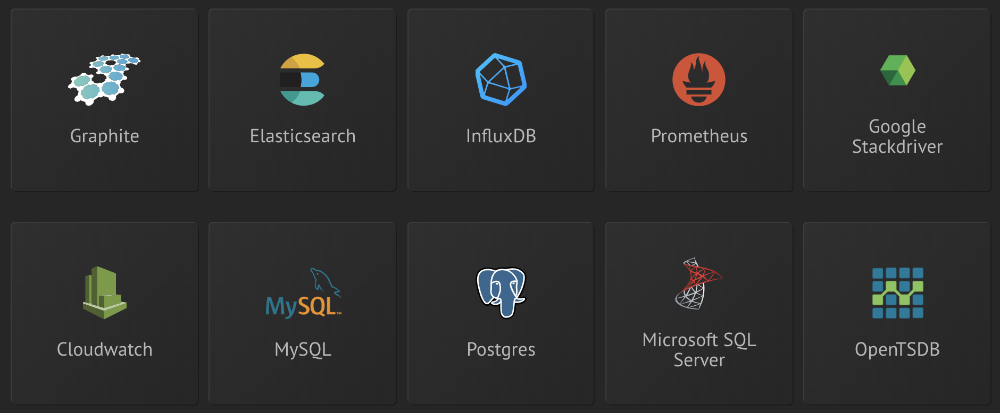
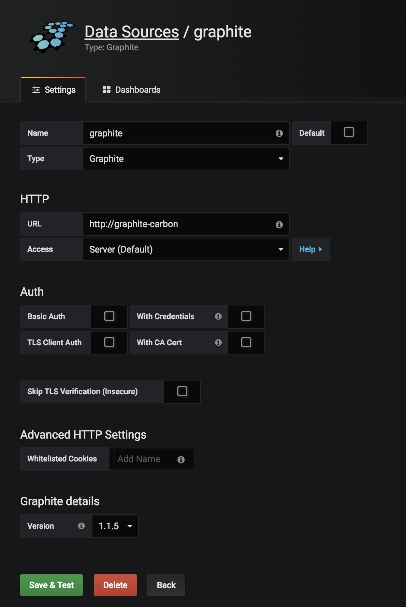

!SLIDE subsection noprint
# ~~~SECTION:MAJOR~~~ Datasources

!SLIDE subsection printonly
# ~~~SECTION:MAJOR~~~ Datasources

!SLIDE noprint
# Configure datasources

As Grafana itself is not a datacollector or centralized timeseries database, it can query multiple datasources, such as **Graphite**, **InfluxDB** or **OpenTSDB**.
When a datasource doesn't exist it could be available from the community.

Those datasources offer a rest api or render api to query these sources.

Every datasource offers different functions which can be used to create graphs.

!SLIDE printonly
# Configure datasources

As Grafana itself is not a datacollector or centralized timeseries database, it can query multiple datasources, such as **Graphite**, **InfluxDB** or **OpenTSDB**.
When a datasource doesn't exist it could be available from the community.

Those datasources offer a rest api or render api to query these sources.

Every datasource offers different functions which can be used to create graphs.

