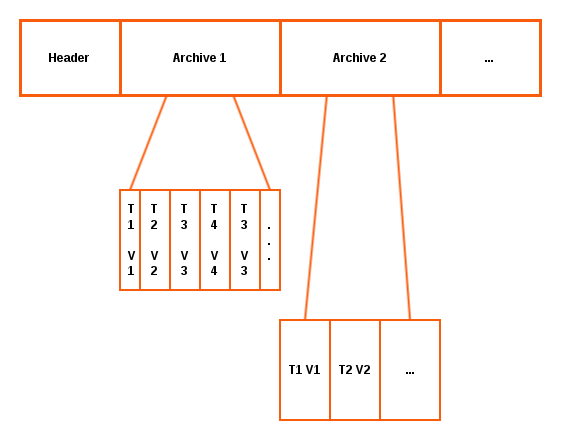

!SLIDE subsectionnonum
# ~~~SECTION:MAJOR~~~.~~~SECTION:MINOR~~~ Data Storage

!SLIDE smbullets
# Whisper

* File based time-series database
* Fixed size (like RRD)
* Values paired with timestamps
* Rollup aggregation
* Multiple archives

Carbon Cache uses Whisper to store the received datapoints. Each datapoint gets paired with its linked timestamp. Data can be stored into multiple archives, where one archive describes the precision and retention of this data.

!SLIDE printonly
# Whisper - Anatomy

!SLIDE noprint
# Whisper - Anatomy

!SLIDE 
# Whisper vs. RRD

In a different way from RRD, Whisper supports updates to time slots with timestamps prior to its most recent one. This means that there is no way with RRD to back-fill data properly.

Whisper is slower than RRD, but fast enough for most purposes. This is the consequence of Whisper being written in Python, where RRD is written in C. The performance is in theory, depending on the operation, 2 to 5 times slower. 

In practice the difference is measured in hundreds of microseconds which leads to less than a millisecond difference for most operations. Anyway, storing time-series data always causes high I/O on your disk. Using Carbon Relay you can distribute this load to multiple servers.

!SLIDE small
# Metric Path

The metric path determines the hierarchy in which data is being held and can be seen as an address of your data. Each element of the metric path describes also a directory on the filesystem where Whisper files are stored. The last element is the filename.

    @@@ Sh
    berlin.dc1.r12.server1.load.longterm
    ├── berlin
    │   └── dc1
    │       └── r12
    │           ├── server1
    │           │   └── load
    │           │       └── longterm.wsp
    │           │       └── midterm.wsp
    │           │       └── shortterm.wsp
    │           ├── server2

With Graphite-Web metrics can be accessed by using globs (wildcards or character lists) in the metric path. Graphite-Web will then return the datapoints of all matching metrics.

    @@@Sh
    berlin.*.r12.server1.load.longterm
    berlin.dc1.r12.server{1,2,3}.load.longterm

!SLIDE smbullets
# Storage Schema

**storage-schemas.conf** stores the configuration about retention and frequency in which datapoints should be stored. The config file includes multiple sections which are applied from the top to the bottom. Based on patterns it matches metric paths and tells Whisper how to store the data. The first pattern that matches is being applied for the metric path, other sections are ignored.

* Config file is read every 60 seconds, no need for reload
* Patterns are regex
* First pattern that matches is used
* Patterns from top to bottom
* Whisper file is created on first metric received

!SLIDE small
# Storage Schema Configuration

Each section has 3 lines:

* name
* pattern
* frequency/retention (multiple)

Example storage schemas:

    @@@Sh
    [carbon]
    pattern = ^carbon\.
    retentions = 60:90d

    [default]
    pattern = .*
    retentions = 1s:30m,1m:1d,5m:7d

By aggregating data you can save I/O on your disks. Already created Whisper files will not be affected by configuration changes!

!SLIDE small
# Storage Aggregation

When downsampling data Whisper will do an average over a set of datapoints. This behaviour can be changed in **storage-aggregation.conf**. Like in other configuration files the entries are scanned from top to the bottom and the first match applies to the Whisper files.

* Pattern
 * Regex pattern to match metric paths
* xFilesFactor
 * Ratio of datapoints that are required to do an aggregation to the next archive (float between 0 and 1)
* aggregationMethod
 * average, sum, min, max, or last

Default aggregation entry:

    @@@Sh
    [default_average]
    pattern = .*
    xFilesFactor = 0.5 # 50 percent
    aggregationMethod = average

This configuration doesn't affect the first archive and already created Whisper files will not be affected by configuration changes!

!SLIDE small
# Whisper File Size

Example storage schema:

    @@@Sh
    1s:30m,1m:1d,5m:7d

Convert into seconds:

    @@@Sh
    1s:30m=1s:(30*60)=1s:1800s
    1m:1d=60s:(24*60*60)=60s:86400s
    5m:7d=(5*60):(7*24*60*60)=300s:604800s

12 bytes for each datapoint and 12 bytes of archive information for every retention period:

    @@@Sh
    1800s/1s*12b+12b=21612b
    86400s/60s*12b+12b=17292b
    604800s/300s*12b+12b=24204b

    21612b+17292b+24204b=63108b

16 bytes of database metadata:

    @@@Sh
    63108b+16b=63124b/1024=61.64kb

!SLIDE
# Whisper File Size Calculator

Online calculator: http://m30m.github.io/whisper-calculator/

~~~SECTION:handouts~~~

****

There's also a script for the calculation of the Whisper file size available: https://gist.github.com/jjmaestro/5774063

~~~ENDSECTION~~~

!SLIDE small
# Whisper Tools (1/2)

Whisper comes with some default tools. With those it is possible to create, edit and view Whisper files.

Tool                                  | Description
------------------------------------- | -------------
**rrd2whisper.py**                    | Convert a rrd file into a whisper (.wsp) file
**whisper-auto-resize.py**            | Resize archives with default settings (>=1.0.0)
**whisper-auto-update.py**            | Update values (>=1.0.0)
**whisper-create.py**                 | Create a new Whisper file
**whisper-diff.py**                   | Differences beetwen two Whisper files 
**whisper-dump.py**                   | Dump raw Whisper data
**whisper-fetch.py**                  | Dump readable (timestamp + value) data from Whisper files
**whisper-fill.py**                   | Backfill datapoints from one whisper file into another

!SLIDE small
# Whisper Tools (2/2)

Tool                                  | Description
------------------------------------- | -------------
**whisper-info.py**                   | Get metadata
**whisper-merge.py**                  | Merge two Whisper files
**whisper-resize.py**                 | Resize archives with individual settings
**whisper-set-aggregation-method.py** | Change aggregation method
**whisper-set-xfilesfactor.py**       | Change xFilesFactor (>=1.0.0)
**whisper-update.py**                 | Update value

!SLIDE small
# Common Whisper Tools Usage (1/2)

    @@@Sh
    # whisper-fetch.py --pretty metricsReceived.wsp
    ...
    Fri Jun  2 08:53:00 2017    976.000000
    Fri Jun  2 08:54:00 2017    1001.000000
    Fri Jun  2 08:55:00 2017    1011.000000

    # whisper-info.py metricsReceived.wsp 
    maxRetention: 7776000
    xFilesFactor: 0.5
    aggregationMethod: average
    fileSize: 1555228

    Archive 0
    retention: 7776000
    secondsPerPoint: 60
    points: 129600
    size: 1555200
    offset: 28

!SLIDE small
# Common Whisper Tools Usage (2/2)

    @@@Sh
    # whisper-resize.py --nobackup metricsReceived.wsp 60s:120d
    Retrieving all data from the archives
    Creating new whisper database: metricsReceived.wsp.tmp
    Created: metricsReceived.wsp.tmp (1555228 bytes)
    Migrating data without aggregation...
    Renaming old database to: metricsReceived.wsp.bak
    Renaming new database to: metricsReceived.wsp

    # whisper-create test.wsp 1s:30m 1m:1d 5m:7d
    Created: test.wsp (63124 bytes)

!SLIDE small
# White- and Blacklisting

When this feature is enabled, each Carbon daemon will only accept metrics that are whitelisted and reject those which are blacklisted. 

Each file, **whitelist.conf** and **blacklist.conf** takes one regular expression per line. If **whitelist.conf** does not exist, everything is whitelisted by default. Configuration is reloaded automatically, no restart of the daemon is necessary.

To enable the functionality, edit **carbon.conf**:

    @@@Sh
    USE_WHITELIST = True
