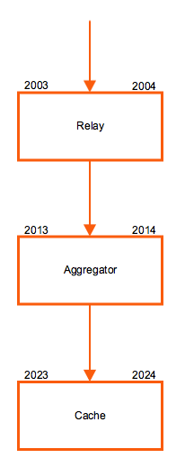

!SLIDE subsectionnonum
#~~~SECTION:MAJOR~~~.~~~SECTION:MINOR~~~ Full Single-Node Setup

!SLIDE noprint
# Full Single-Node Setup

!SLIDE printonly
# Full Single-Node Setup

!SLIDE small
# Carbon Daemon Configuration 

All Carbon daemons are configured in **carbon.conf** where each daemon gets its own section.

File: **/opt/graphite/conf/carbon.conf**

    @@@Sh
    [cache]
    LINE_RECEIVER_PORT = 2023         # default: 2003
    PICKLE_RECEIVER_PORT = 2024       # default: 2004
    CACHE_QUERY_PORT = 7002

    [relay]
    LINE_RECEIVER_PORT = 2003         # default: 2013
    PICKLE_RECEIVER_PORT = 2004       # default: 2014

    RELAY_METHOD = consistent-hashing # default: rules
    DESTINATIONS = 127.0.0.1:2014     # default: :2004

    [aggregator]
    LINE_RECEIVER_PORT = 2013         # default: 2023
    PICKLE_RECEIVER_PORT = 2014       # default: 2024

    DESTINATIONS = 127.0.0.1:2024     # default: :2004

!SLIDE
# Carbon Relay Configuration

Take care of **relay-rules.conf**:

    @@@Sh
    # cp $GRAPHITE/conf/relay-rules.conf.example \
    $GRAPHITE/conf/relay-rules.conf

!SLIDE small
# Relay Methods

The `RELAY_METHOD` defines how metrics are distributed: 

* `consistent-hashing`
 * Even distribution of metrics between destinations
* `aggregated-consistent-hashing`
 * Send to a group of Carbon Aggregators
* `rules`
 * Route metrics to destinations based on pattern rules
 * Requires **relay-rules.conf**

Example rule in **/opt/graphite/conf/relay-rules.conf** with `rules` RELAY_METHOD:

    @@@Sh
    [collectd_dc1]
    pattern = ^collectd\.dc1\.
    destinations = 127.0.0.1:2104:a

    [collectd_dc2]
    pattern = ^collectd\.dc2\.
    destinations = 127.0.0.1:2204:b

!SLIDE
# Carbon Relay Service Unit

File: **/etc/systemd/system/carbon-relay.service**

    @@@Sh
    [Unit]
    Description=Graphite Carbon Relay
    After=network.target

    [Service]
    Type=forking
    StandardOutput=syslog
    StandardError=syslog
    ExecStart=/opt/graphite/bin/carbon-relay.py \
      --instance=a \
      --config=/opt/graphite/conf/carbon.conf \
      --pidfile=/var/run/carbon-relay.pid \
      --logdir=/var/log/carbon/ start
    ExecReload=/bin/kill -USR1 $MAINPID
    PIDFile=/var/run/carbon-relay.pid

    [Install]
    WantedBy=multi-user.target

!SLIDE
# Start Carbon Relay Daemon

Start Carbon Relay daemon with systemd:

    @@@Sh
    # systemctl restart carbon-cache-a.service

    # systemctl daemon-reload
    # systemctl start carbon-relay.service
    # systemctl enable carbon-relay.service

!SLIDE
# Carbon Aggregator Configuration 

Take care of **aggregation-rules.conf**:

    @@@Sh
    # cp $GRAPHITE/conf/aggregation-rules.conf.example \
    $GRAPHITE/conf/aggregation-rules.conf

!SLIDE
# Aggregation Rules

When using Carbon Aggregator, the most important configuration is made in **aggregation-rules.conf**. The file accepts input patterns for metrics and is able to merge multiple incoming metrics to one final metric which is then written as single Whisper file.

Each line of the configuration should look like this:

    @@@Sh
    output_template (frequency) = method input_pattern

This will capture any metric that matches `input_pattern`. Every `frequency` seconds it will calculate the destination metric using the specified `method` which can be `sum` or `avg`. The config also accepts placeholders.

!SLIDE
# Aggregation Rules Example

Here is an example of an Apache environment. Goal is to track requests from all application servers and store the sum in a single metric:

    @@@Sh
    <env>.applications.<app>.all.requests (60) 
      = sum <env>.applications.<app>.*.requests

The result is, that metrics matching the pattern will get summed each 60 seconds and written to one single destination:

    @@@Sh
    # input
    prod.applications.apache.www01.requests
    prod.applications.apache.www02.requests
    prod.applications.apache.www03.requests
    
    # output
    prod.applications.apache.all.requests

!SLIDE
# Carbon Aggregator Service Unit

File: **/etc/systemd/system/carbon-aggregator.service**

    @@@Sh
    [Unit]
    Description=Graphite Carbon Aggregator
    After=network.target

    [Service]
    Type=forking
    StandardOutput=syslog
    StandardError=syslog
    ExecStart=/opt/graphite/bin/carbon-aggregator.py \
      --instance=a \
      --config=/opt/graphite/conf/carbon.conf \
      --pidfile=/var/run/carbon-aggregator.pid \
      --logdir=/var/log/carbon/ start
    ExecReload=/bin/kill -USR1 $MAINPID
    PIDFile=/var/run/carbon-aggregator.pid

    [Install]
    WantedBy=multi-user.target

!SLIDE
# Start Carbon Aggregator Daemon

Start Carbon Aggregator daemon with systemd:

    @@@Sh
    # systemctl daemon-reload
    # systemctl start carbon-aggregator.service
    # systemctl enable carbon-aggregator.service

!SLIDE
# Rewrite Rules

With rewrite rules, metric paths can be rewritten before Whisper files are created. This is handy when your collector sends metric paths which are not accurate. The configuration for rewrite rules takes place in **rewrite-rules.conf**. This functionality is currently only available for Carbon Aggregator.

A rewrite rule should look like as follows:

    @@@Sh
    regex-pattern = replacement-text

These are some rewrite rules commonly used when collectd sends metrics:

    @@@Sh
    [pre]
    \.load\.load\. = .load.
    \.mysql\.stats\. = .mysql.
    _TCP80 = .TCP80

Rewrite rules consists of two sections `[pre]` and `[post]`. Rules in the pre section are applied before aggregation and rules in the post section after aggregation takes place.
