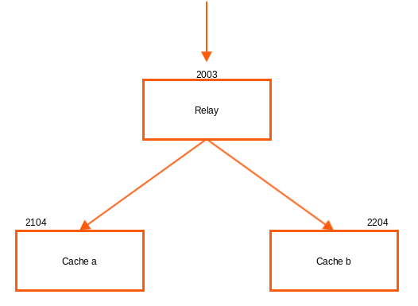
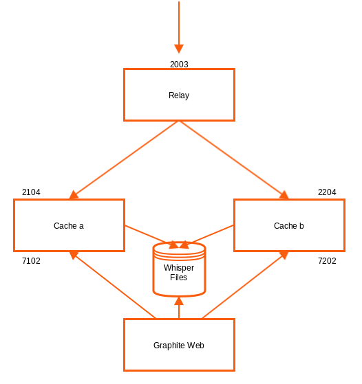
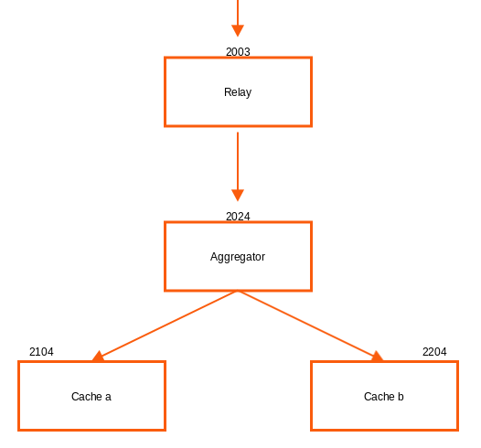
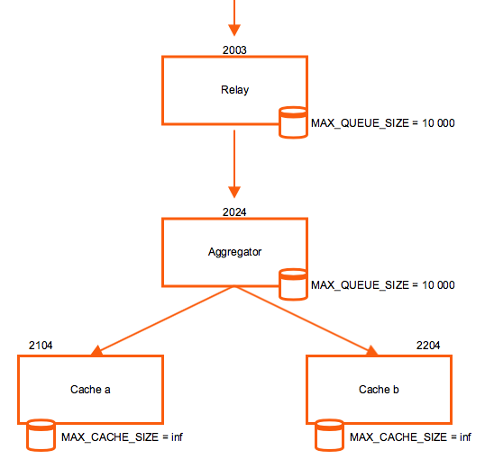

!SLIDE subsectionnonum
#~~~SECTION:MAJOR~~~.~~~SECTION:MINOR~~~ Single-Node Cluster

!SLIDE noprint
# Graphite Single-Node Cluster

In this scenario Carbon Relay distributes metrics over 2 Carbon Caches. As the communication between all Carbon daemons, they all can be located on different hosts.

!SLIDE printonly
# Graphite Single-Node Cluster

In this scenario Carbon Relay distributes metrics over 2 Carbon Caches. As the communication between all Carbon daemons, they all can be located on different hosts.

!SLIDE small smbullets
# Graphite Single-Node Cluster - Carbon Caches

All Carbon daemons are configured in `carbon.conf` where each daemon gets its own section.

Configure multiple caches in `/opt/graphite/conf/carbon.conf` and start them:

    @@@Sh
    [cache]
    LINE_RECEIVER_PORT   = 2103
    UDP_RECEIVER_PORT    = 2103
    PICKLE_RECEIVER_PORT = 2104
    CACHE_QUERY_PORT     = 7102

    [cache:b]
    LINE_RECEIVER_PORT   = 2203
    UDP_RECEIVER_PORT    = 2203
    PICKLE_RECEIVER_PORT = 2204
    CACHE_QUERY_PORT     = 7202

    # /opt/graphite/bin/carbon-cache.py --instance=a start
    Starting carbon-cache (instance a)
    # /opt/graphite/bin/carbon-cache.py --instance=b start
    Starting carbon-cache (instance b)

!SLIDE small
# Graphite Single-Node Cluster - Carbon Relay with Caches

Configure the Carbon Relay `/opt/graphite/conf/carbon.conf`, take care of `relay-rules.conf` and start it:

    @@@Sh
    [relay]
    LINE_RECEIVER_INTERFACE = 0.0.0.0
    LINE_RECEIVER_PORT = 2003
    PICKLE_RECEIVER_INTERFACE = 0.0.0.0
    PICKLE_RECEIVER_PORT = 2004
    RELAY_METHOD = consistent-hashing
    REPLICATION_FACTOR = 1
    DESTINATIONS = 127.0.0.1:2104:a, 127.0.0.1:2204:b

    # cp /opt/graphite/conf/relay-rules.conf.example \
    /opt/graphite/conf/relay-rules.conf

    # /opt/graphite/bin/carbon-relay.py start
    Starting carbon-relay (instance a) 

!SLIDE small smbullets
# Carbon Relay - Relay Method

The `RELAY_METHOD` defines how metrics are distributed. 

* `consistent-hashing`
 * Even distribution of metrics between destinations.
* `aggregated-consistent-hashing`
 * Send to a group of Carbon Aggregators.
* `rule-based`
 * Route metrics to destinations based on pattern rules.
 * `relay-rules.conf`

Example rule in `/opt/graphite/conf/relay-rules.conf` with `rule-based` RELAY_METHOD:

    @@@Sh
    [collectd_dc1]
    pattern = ^collectd\.dc1\.
    destinations = 127.0.0.1:2104:a

    [collectd_dc2]
    pattern = ^collectd\.dc2\.
    destinations = 127.0.0.1:2204:b

!SLIDE noprint
# Graphite Single-Node Cluster with Graphite Web

!SLIDE printonly
# Graphite Single-Node Cluster with Graphite Web

!SLIDE small smbullets
# Graphite Single-Node Cluster - Graphite Web Configuration

Graphite Web needs to be configured to query both Carbon Caches.

File: `/opt/graphite/webapp/graphite/local_settings.py`:

    @@@Sh
    CARBONLINK_HOSTS = ["127.0.0.1:7102:a", "127.0.0.1:7202:b"]

Restart Apache:

    @@@Sh
    # systemctl restart httpd.service

!SLIDE noprint
# Graphite Single-Node Cluster with Aggregator

!SLIDE printonly
# Graphite Single-Node Cluster with Aggregator

!SLIDE small
# Graphite Single-Node Cluster - Carbon Relay with Aggregator

Stop Carbon Relay:

    @@@Sh
    # /opt/graphite/bin/carbon-relay.py stop

Change Relay configuration in `carbon.conf`:

    @@@Sh
    [relay]
    LINE_RECEIVER_INTERFACE = 0.0.0.0
    LINE_RECEIVER_PORT = 2003
    PICKLE_RECEIVER_INTERFACE = 0.0.0.0
    PICKLE_RECEIVER_PORT = 2004
    RELAY_METHOD = consistent-hashing # Only with 1 Aggregator
    REPLICATION_FACTOR = 1
    DESTINATIONS = 127.0.0.1:2024

Start Carbon Relay:

    @@@Sh
    # /opt/graphite/bin/carbon-relay.py start
    Starting carbon-relay (instance a)

!SLIDE small
# Graphite Single-Node Cluster - Carbon Aggregator with Caches

Change Aggregator configuration in `carbon.conf`:

    @@@Sh
    [aggregator]
    LINE_RECEIVER_INTERFACE = 0.0.0.0
    LINE_RECEIVER_PORT = 2023
    PICKLE_RECEIVER_INTERFACE = 0.0.0.0
    PICKLE_RECEIVER_PORT = 2024
    FORWARD_ALL = True # Forward all metrics
    DESTINATIONS = 127.0.0.1:2104:a, 127.0.0.1:2204:b
    REPLICATION_FACTOR = 1

Take care of `aggregation-rules.conf` and start Carbon Aggregator:

    @@@Sh
    # cp /opt/graphite/conf/aggregation-rules.conf.example \
    /opt/graphite/conf/aggregation-rules.conf

    # /opt/graphite/bin/carbon-aggregator.py start
    Starting carbon-aggregator (instance a)

Note: The configuration for the Carbon Caches remains unchanged.

!SLIDE small smbullets
# Carbon Aggregator

When using Carbon Aggregator, the most important configuration is made in `aggregation-rules.conf`. The file accepts input patterns for metrics and is able to merge multiple incoming metrics to one final metric which is then written as single Whisper file.

Each line of the configuration should look like this:

    @@@Sh
    output_template (frequency) = method input_pattern

This will capture any metric that matches `input_pattern`. Every `frequency` seconds it will calculate the destination metric using the specified `method` which can be `sum` or `avg`. The config also accepts placeholders.

!SLIDE small smbullets
# Carbon Aggregator - Example

Here is an example of an Apache environment. Goal is to track requests from all application servers and store the sum in a single metric.

    @@@Sh
    <env>.applications.<app>.all.requests (60) 
      = sum <env>.applications.<app>.*.requests

The result is, that metrics matching the pattern will get summed each 60 seconds and written to one single destination:

    @@@Sh
    # input
    prod.applications.apache.www01.requests
    prod.applications.apache.www02.requests
    prod.applications.apache.www03.requests
    
    # output
    prod.applications.apache.all.requests

!SLIDE noprint
# Relaying of Carbon Aggregator

The Aggregator does not have the same complement of routing methods as the Relay and supports only consistent-hashing. For rule-based routing an additional Relay beetwen Aggregator and Cache is needed.

!SLIDE printonly
# Relaying of Carbon Aggregator

The Aggregator does not have the same complement of routing methods as the Relay and supports only consistent-hashing. For rule-based routing an additional Relay beetwen Aggregator and Cache is needed.

!SLIDE noprint
# Queues and Caches

Each Carbon daemon will start dropping or not accepting metrics if its queue or cache is full. The parameters `MAX_QUEUE_SIZE` and `MAX_CACHE_SIZE` are configured in `carbon.conf` in the proper section.

!SLIDE printonly
# Queues and Caches

Each Carbon daemon will start dropping or not accepting metrics if its queue or cache is full. The parameters `MAX_QUEUE_SIZE` and `MAX_CACHE_SIZE` are configured in `carbon.conf` in the proper section.

!SLIDE small
# Carbonate

Carbonate brings some usefull tools to handle different tasks in Graphite clusters, for example to redistribute datapoints manually when new nodes are introduced.

    @@@Sh
    # pip install carbonate

The configuration of Carbonate is done in: `/opt/graphite/conf/carbonate.conf`

    @@@Sh
    [main]
    DESTINATIONS = 127.0.0.1:2104:a, 127.0.0.1:2204:b
    REPLICATION_FACTOR = 1
    SSH_USER = carbonate # optional

!SLIDE small
# Carbonate Tools

Tool                  | Description
--------------------- | -------------
**carbon-hosts**      | Return the addresses for all nodes in a cluster
**carbon-list**       | List the metrics this carbon node contains
**carbon-lookup**     | Lookup where a metric lives in a carbon cluster
**carbon-path**       | Transform metric paths to (or from) filesystem paths
**carbon-sieve**      | Given a list of metrics, output those that belong to a node
**carbon-stale**      | Find and list potentially stale metrics
**carbon-sync**       | Sync local metrics using remote nodes in the cluster
**whisper-aggregate** | Set aggregation for whisper-backed metrics this carbon instance contains
**whisper-fill**      | Backfill datapoints from one whisper file into another

~~~SECTION:handouts~~~

****

Project: https://github.com/graphite-project/carbonate

~~~ENDSECTION~~~
