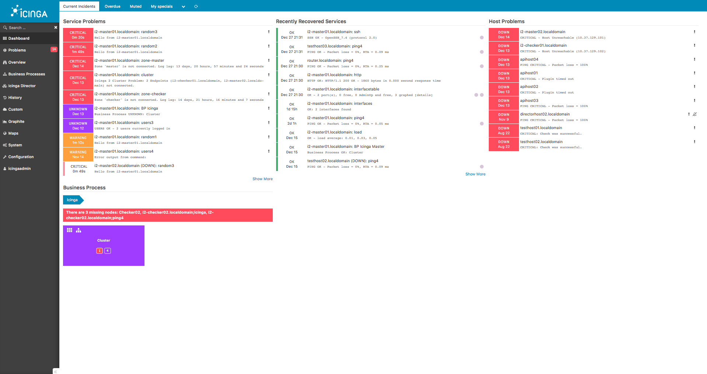
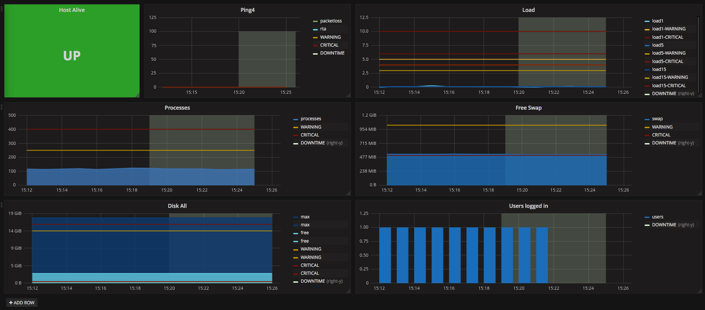

!SLIDE smbullets
# Icinga Overview

* Active and passive monitoring
* Wide choice of plugins
 * CPU, Load, Memory, Disk, ...
 * Dell, Hewlett Packard, Microsoft, VMware, Juniper, ...
* Performance data included
* Scalable
* Alerting
* Native Graphite support (since Icinga 2)

Icinga is actually a tool for availability monitoring, which tells you if your hosts or services have any problems. As a part of this monitoring most of the plugins are able to deliver also performance data.

~~~SECTION:handouts~~~
****

Project: https://www.icinga.com 
Docs: https://www.icinga.com/resources/docs

~~~ENDSECTION~~~

!SLIDE smbullets
# Icinga Checks

Icinga executes checks and evaluates results to trigger notifications or events. A spin-off product of these checks are performance data.

* Checks run periodically
* Checks can be
 * disk, load, memory, cpu, processes, ...
 * VMWare, Microsoft, Dell, HP, ...
 * MySQL, PostgreSQL, Apache2, NginX, ...
 * Many more
* Full compatibility to Nagios plugins

!SLIDE smbullets
# Forwarding Data with Icinga 2

One of Icinga 2's key features is the forwarding of stuff. Nearly any data can be forwarded to one or multiple backends.

* Forward
 * Performance Data
 * Check results
 * Thresholds
 * Logs

* Forward to
 * Graphite
 * InfluxDB/OpenTSDB
 * Graylog/Logstash
 * PNP4Nagios
 * Elasticsearch

!SLIDE smbullets
# Training Environment

One of your training virtual machines already includes the following installation:

* Icinga 2 Core
 * Monitoring plugins
 * IDO support (MariaDB Database)
* Icinga Web 2

!SLIDE smbullets
# Icinga Web 2

Icinga Web 2 is a webinterface for Icinga. You can view the current state of your hosts and services and check out historical data.

* Create dashboards
* Current and historical states
* Groups
* Contacts
* Acknowledge problems
* Set downtimes
* Comments
* Reschedule checks
* Reporting

!SLIDE noprint
# Icinga Web 2

Icinga Web 2 is available on "graphing1.localdomain" under "/icingaweb2" with user **icingaadmin** and password **icinga**.

!SLIDE printonly
# Icinga Web 2

Icinga Web 2 is available on "graphing1.localdomain" under "/icingaweb2" with user **icingaadmin** and password **icinga**.

!SLIDE small
# Storage Schema for Icinga 2

Icinga 2 provides a storage schema with use for Graphite. Keep in mind that storage schemas are applied from the top to the bottom and the first match wins. How your storage schema looks like depends on your check intervals. By default the check interval is set to 1 minute.

File: **/opt/graphite/conf/storage-schemas.conf**

    @@@Sh
    [...]

    [icinga2_metadata]
    pattern = ^icinga2\..*\.metadata\.
    retentions = 1m:7d
    
    [icinga2_perfdata]
    pattern = ^icinga2\..*\.perfdata\.
    retentions = 1m:2d,5m:10d,30m:90d,360m:4y

    [...]

!SLIDE noprint
# Threshold Metrics

Many of the Icinga plugins provide configured thresholds in addition to the performance counters. This is very useful when creating graphs using this data.

With graphs that also show thresholds one can see occuring problems on first sight.

!SLIDE printonly
# Threshold Metrics

Many of the Icinga plugins provide configured thresholds in addition to the performance counters. This is very useful when creating graphs using this data.

With graphs that show thresholds one can see occuring problems on first sight.

!SLIDE small
# Icinga 2 Graphite Feature

Every part of Icinga 2 is a module, also called feature. To add Graphite support to Icinga 2 you need to enable and configure the proper feature.

    @@@Sh 
    # icinga2 feature list
    # icinga2 feature enable graphite

Edit the configuration for the Graphite feature and enable at least sending of thresholds.

File: **/etc/icinga2/features-enabled/graphite.conf**

    @@@Sh
    object GraphiteWriter "graphite" {
      host = "127.0.0.1"            // default
      port = 2003                   // default

      enable_send_thresholds = true // required
      enable_send_metadata = true   // optional
    }

Validate the configuration and restart Icinga 2:

    @@@Sh
    # icinga2 daemon -C
    # systemctl restart icinga2.service

!SLIDE small
# Icinga 2 InfluxDB Feature

Enabling the Icinga InfluxDB feature is similar than the Graphite feature:

    @@@Sh
    # icinga2 feature enable influxdb

File: **/etc/icinga2/features-enabled/influxdb.conf**

    @@@Sh
    object InfluxdbWriter "influxdb" {
      host = "127.0.0.1"            // default
      port = 8086                   // default
      database = "icinga2"          // default
      ...

      enable_send_thresholds = true // optional
      enable_send_metadata = true   // optional
    }

Validate the configuration and restart Icinga 2:

    @@@Sh
    # icinga2 daemon -C
    # systemctl restart icinga2.service

!SLIDE noprint
# Grafana Dashboard

With Icinga 2 as Collector you can import a dashboard called "**Icinga2 with Graphite**" provided by the Icinga Project with ID "56".

!SLIDE printonly
# Grafana Dashboard

With Icinga 2 as Collector you can import a dashboard called "**Icinga2 with Graphite**" provided by the Icinga Project with ID "56".

