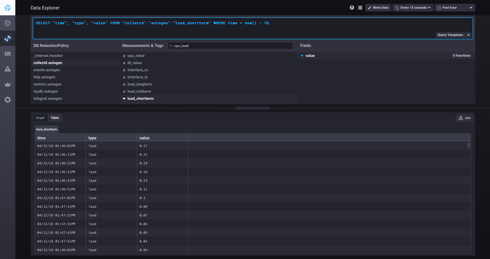
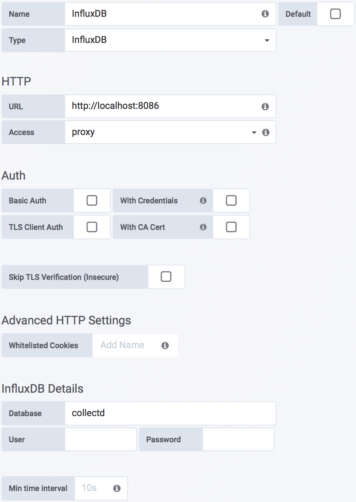

!SLIDE smbullets
# Overview of InfluxDB

* Time series data storage
* Part of TICK Stack
* Stores event data (exceptions, deploys, logins, ...)
* SQL like query language
* HTTP(S) API
* No rendering or collection of data
* Written in Go

**Note:** Unfortunately High-Availability and Clustering are features of InfluxEnterprise only.

~~~SECTION:handouts~~~
****

InfluxData: https://www.influxdata.com 
Documentation: https://docs.influxdata.com

~~~ENDSECTION~~~

!SLIDE noprint
# TICK Stack

!SLIDE printonly
# TICK Stack

!SLIDE small
# InfluxData Installation

InfluxData provides packages for most common used Unix operating systems.

File: **/etc/yum.repos.d/influxdb.repo**

    @@@Sh
    [influxdb]
    name = InfluxDB Repository - RHEL \$releasever
    baseurl = https://repos.influxdata.com/rhel/\$releasever/\$basearch/stable
    enabled = 1
    gpgcheck = 1
    gpgkey = https://repos.influxdata.com/influxdb.key

    # yum -y install influxdb chronograf telegraf

**Note:** InfluxDB, Chronograf and Telegraf are already pre-installed on "graphing1.localdomain".

!SLIDE small
# InfluxData Services 

We have to start InfluxDB, Chronograf and Telegraf:

    @@@Sh
    # systemctl start influxdb.service
    # systemctl start chronograf.service
    # systemctl start telegraf.service

!SLIDE smbullets
# InfluxDB Ports

InfluxDB opens a bunch of ports. Not all of them are used by default, but its good to know what they are useful for.

* Default ports
 * `8086`: HTTP(S) API for client-server communication
 * `8088`: RPC service for backup and restore
 * `8888`: Chronograf webinterface

!SLIDE noprint
# Chronograf Setup

Chronograf is available on "graphing1.localdomain" on port "8888". We have to setup a new connection to InfluxDB and the name of the Telegraf database.

!SLIDE printonly
# Chronograf Setup

Chronograf is available on "graphing1.localdomain" on port "8888". We have to setup a new connection to InfluxDB and the name of the Telegraf database.

!SLIDE noprint
# Chronograf Host List

Chronograf's Host List Menu shows metrics collected from Telegraf:

!SLIDE printonly
# Chronograf Host List

Chronograf's Host List Menu shows metrics collected from Telegraf:

!SLIDE
# Telegraf Plugins

* Default data collection interval is 10s
* > 70 input plugins
 * Docker, Kubernetes, MongoDB, Prometheus, Puppet Agent, StatsD, etc.
* > 20 output plugins
 * Elasticsearch, Graphite, Graylog, Kafka, OpenTSDB, Prometheus, etc.

Telegraf provides a built-in output for Graphite.

File: **/etc/telegraf/telegraf.conf**

    @@@Sh
    [[outputs.graphite]]
        servers = ["localhost:2003"]
        prefix = "telegraf"

!SLIDE
# Telegraf Graphite Output Plugin

Care about a proper storage schema:

File: **/opt/graphite/conf/storage-schemas.conf**

    @@@Sh
    [...]

    [telegraf]
    pattern = ^telegraf\.
    retentions = 10s:5d

    [...]

Restart Telegraf with systemd:

    @@@Sh
    # systemctl restart telegraf.service

~~~SECTION:handouts~~~
****

Telegraf plugins: https://docs.influxdata.com/telegraf/latest/plugins

~~~ENDSECTION~~~

!SLIDE
# InfluxDB Data Model

    @@@Sh
    name: cpu
    time                   usage_system   host
    ----                   ------------   ----
    04/12/18 02:11:30PM    0.35087        graphing1
    04/12/18 02:11:40PM    0.30075        graphing2
    04/12/18 02:11:50PM    0.25075        graphing1

* **Measurement:** cpu
* **Field key:** usage_system
* **Field values:** 0.35087, 0.30075, 0.25075
* **Tag key:** host
* **Tag values:** graphing1, graphing2

Line protocol:

    @@@Sh
    cpu,host=graphing1 usage_system=0.35087 1523539329
    measurement,tag(s) field(s) timestamp

!SLIDE
# Write Data Using HTTP API

The easiest method for adding datapoints to a InfluxDB database is by using the HTTP API. Most client libraries use this and its easy to build into custom applications.
Here is an example how you could use InfluxDB as metric database.

    @@@Sh
    # curl -i -XPOST http://localhost:8086/query \
    --data-urlencode "q=CREATE DATABASE metrics"

    # curl -i -XPOST 'http://localhost:8086/write?db=metrics' \
    --data-binary 'cpu,host=graphing1,region=europe \
    value=0.64 1523540001'

Multiple Points:

    @@@Sh
    # curl -i -XPOST 'http://localhost:8086/write?db=metrics' \
    --data-binary 'cpu,host=graphing2 value=0.67 \
    cpu,host=graphing1,region=europe value=2.0 \
    cpu,host=graping2 value=1.20 1422568543702900257'

**Note:** If points are provided without timestamp, the server's local timestamp is used.

!SLIDE
# HTTP Repsonses

* **2xx**: If your write request received `HTTP 204 No Content`, it was a success!
* **4xx**: InfluxDB could not understand the request.
* **5xx**: The system is overloaded or significantly impaired.

Example output after adding points:

    @@@Sh
    HTTP/1.1 204 No Content
    Content-Type: application/json
    Request-Id: e28fee07-4cde-11e7-8083-000000000000
    X-Influxdb-Version: 1.2.4
    Date: Fri, 09 Jun 2017 06:43:02 GMT

!SLIDE
# Query Data Using HTTP API

The output of queries is returned in JSON:

    @@@Sh
    # curl -G 'http://localhost:8086/query?pretty=true' \
    --data-urlencode "db=metrics" --data-urlencode \
    "q=SELECT \"value\" FROM \"cpu\" WHERE \
    \"region\"='us-west'"

Multiple queries can be stacked together with semicolon as delimiter:

    @@@Sh
    # curl -G 'http://localhost:8086/query?pretty=true' \
    --data-urlencode "db=metrics" --data-urlencode \
    "q=SELECT \"value\" FROM \"cpu\" WHERE \
    \"region\"='us-west'; SELECT count(\"value\") \
    FROM \"cpu\" WHERE \"region\"='us-west'"

!SLIDE
# InfluxDB Shell

The InfluxDB Shell is part of every InfluxDB installation.

    @@@Sh
    # influx
    Connected to http://localhost:8086 version 1.5.1
    InfluxDB shell version: 1.5.1

    > CREATE DATABASE metrics

    > USE metrics
    Using database metrics

    > INSERT cpu,host=graphing2,region=us-west value=0.64
    > INSERT cpu,host=graphing1,region=europe value=0.23

    > SELECT * FROM "cpu"
    name: cpu
    time       host      region  value
    ----       ----      ------  -----
    1523540001 graphing1 us-west 0.64
    1523540064 graphing1 europe  0.23

    > quit

!SLIDE
# InfluxDB Listeners

* HTTP API
 * Send Post request to with a proper body to InfluxDB to add datapoints to a database.
 * Default port: `8086`
* Graphite
 * Support for Carbon protocol, which Graphite uses for receiving metrics.
* collectd
 * collectd has its own binary protocol to communicate with other collectd nodes.
 * Default port: `25826`
* OpenTSDB
 * InfluxDB supports both the telnet and HTTP OpenTSDB protocol.
 * Default port: `4242`
* UDP
 * Sending data in JSON format via UDP is supported.
 * Default port: `8089`

!SLIDE small
# Prepare InfluxDB for collectd

Both, "CollectD" and "Graphite"-Service Plugins can be used to connect collectd to InfluxDB. In this case we want to use the "CollectD" Service Plugin and enable it in **/etc/influxdb/influxdb.conf**:

    @@@Sh
    [[collectd]]
      enabled = true
      bind-address = ":25826"
      database = "collectd"

After a restart of InfluxDB the `collectd` database must be created manually:

    @@@Sh
    # systemctl restart influxdb.service

    # curl -i -XPOST http://localhost:8086/query \
    --data-urlencode "q=CREATE DATABASE collectd"

!SLIDE small
# Connect collectd to InfluxDB

InfluxDB opens port 25826 after the restart, so we can connect collectd to send data to InfluxDB.

File: **/etc/collectd.d/network.conf**

    @@@Sh
    LoadPlugin network

    <Plugin network>
      Server "localhost" "25826"
    </Plugin> 

And reload the collectd daemon afterwards:

    @@@Sh
    # systemctl restart collectd.service

!SLIDE noprint
# Chronograf Data Explorer

With the Data Explorer included in Chronograf you can create, edit and delete databases. Also data can be explored by using the build in query language.

!SLIDE printonly
# Chronograf Data Explorer

With the Data Explorer included in Chronograf you can create, edit and delete databases. Also data can be explored by using the build in query language.

!SLIDE
# Influx Query Language

Influx Query Language (InfluxQL) is InfluxDB’s SQL-like query language for interacting with data in InfluxDB:

* Data exploration: `SELECT`, `WHERE`, `GROUP BY`, `INTO`
* Schema exploration: `SHOW`
* Data mangement: `CREATE`, `DROP`, `DELETE`, `ALTER`
* InfluxQL continuous queries
* InfluxQL functions: Aggregations, Selectors, Transformations, Predictors
* InfluxQL mathematical operators

~~~SECTION:handouts~~~
****

InfluxQL: https://docs.influxdata.com/influxdb/latest/query_language/

~~~ENDSECTION~~~

!SLIDE
# InfluxQL Examples (1/2)

Return a list of series for the specified database:

    @@@SQL
    SHOW SERIES ON "collectd"

Return a list of measurements:

    @@@SQL
    SHOW MEASUREMENTS ON "collectd"

Return a list of tag keys:

    @@@SQL
    SHOW TAG KEYS ON "collectd"

!SLIDE small
# InfluxQL Examples (2/2)

Load of one server:

    @@@SQL
    SELECT "time", "host", "value" FROM "collectd".\
      "autogen"."load_shortterm"

    SELECT * FROM "collectd"."autogen"."load_shortterm"
      WHERE "host" = 'graphing1.localdomain'

Select timeframe:

    @@@SQL
    SELECT * FROM "collectd"."autogen"."load_shortterm"
      WHERE time > now() - 1h

    SELECT * FROM load_shortterm
      WHERE time < '2018-03-18 12:50' 
      WHERE time > '2018-04-18 12:50'

Delete data:

    @@@SQL
    DELETE FROM "collectd"."autogen"."load_shortterm"
      WHERE time > now() - 1h

!SLIDE noprint
# Grafana InfluxDB Data Source

Add the InfluxDB data source with the "**collectd**" database to Grafana:

!SLIDE printonly
# Grafana InfluxDB Data Source

Add the InfluxDB data source with the "**collectd**" database to Grafana:

!SLIDE
# InfluxGraph

InfluxGraph (formerly: Graphite-InfluxDB) is a storage plugin to use InfluxDB as a drop-in replacement data store to the Graphite query API

~~~SECTION:handouts~~~
****

Project: https://github.com/InfluxGraph/influxgraph

~~~ENDSECTION~~~

!SLIDE
# Stop Services

We have to stop serval services due to limited system resources in our training environment:

    @@@Sh
    # systemctl stop statsd.service
    # systemctl stop collectd.service
    # systemctl stop telegraf.service
    # systemctl stop chronograf.service
    # systemctl stop influxdb.service
