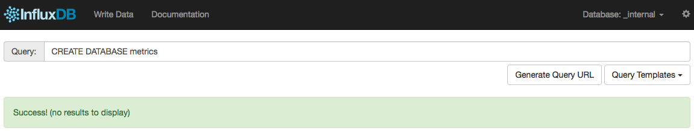
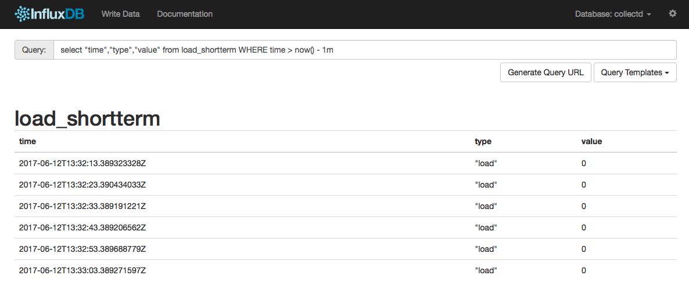

!SLIDE subsection
# ~~~SECTION:MAJOR~~~ InfluxDB

!SLIDE smbullets
# InfluxDB

* Time series data storage
* SQL like query language
* HTTP(S) API
* Management interface
* Store event data (exceptions, deploys, logins, ...)

Note: Unfortunately Clustering is a feature of InfluxEnterprise only.

!SLIDE small
# InfluxDB Installation

InfluxDB provides packages for CentOS:

    @@@Sh
    # cat <<EOF | sudo tee /etc/yum.repos.d/influxdb.repo
    [influxdb]
    name = InfluxDB Repository - RHEL \$releasever
    baseurl = https://repos.influxdata.com/rhel/\$releasever/\
    \$basearch/stable
    enabled = 1
    gpgcheck = 1
    gpgkey = https://repos.influxdata.com/influxdb.key
    EOF

    # yum install influxdb-1.2.4

Note: The repo is already pre-installed on `graphing1.localdomain`.

!SLIDE small
# InfluxDB Configuration

We have to enable the admin user interface in `/etc/influxdb/influxdb.conf`:

    @@@Sh
    [admin]
      enabled = true

And start InfluxDB:

    @@@Sh
    # systemctl start influxdb.service

!SLIDE smbullets
# InfluxDB Ports

InfluxDB opens a bunch of ports. Not all of them are used by default, but its good to know what they are good for.

* Default ports
 * `8083`: Admin user interface
 * `8086`: HTTP(S) API for client-server communication
 * `8088`: RPC service for backup and restore

!SLIDE small smbullets
# InfluxDB Service Plugins

Service plugins describe methods which are used to feed in data into InfluxDB. All client libraries go through one of these plugins. 

* HTTP API
 * Send `Post` request to with a proper body to InfluxDB to add datapoints to a database.
 * Default port: `8086`
* Graphite
 * Support for Carbon protocol, which Graphite uses for receiving metrics.
* CollectD
 * collectd has its own binary protocol to communicate with other collectd nodes.
 * Default port: `25826`
* OpenTSDB
 * InfluxDB supports both the telnet and HTTP OpenTSDB protocol.
 * Default port: `4242`
* UDP
 * Sending data in JSON format via UDP is supported.
 * Default port: `8089`

!SLIDE
# InfluxDB Web Admin Interface

InfluxDB brings its own webinterface for administration tasks on port 8083. You can create, edit and delete databases. Also data can be explored by using the build in query language.

!SLIDE small
# Write Single Points Using HTTP API

The easiest method for adding datapoints to a InfluxDB database is by using the HTTP API. Most client libraries use this and its easy to build into custom applications.
Here is an example how you could use InfluxDB as metric database.

    @@@Sh
    # curl -i -XPOST http://localhost:8086/query \
    --data-urlencode "q=CREATE DATABASE metrics"

    # curl -i -XPOST 'http://localhost:8086/write?db=metrics' \
    --data-binary 'cpu_load_short,host=server01,region=us-west \
    value=0.64 1434055562000000000'

* measurement: cpu_load_short
* tag keys: host, region
* tag values: server01, us-west
* field key: value
* field value: 0.64

!SLIDE smbullets small
# HTTP Repsonses

* **2xx**: If your write request received `HTTP 204 No Content`, it was a success!
* **4xx**: InfluxDB could not understand the request.
* **5xx**: The system is overloaded or significantly impaired.

Example output after adding points:

    @@@Sh
    HTTP/1.1 204 No Content
    Content-Type: application/json
    Request-Id: e28fee07-4cde-11e7-8083-000000000000
    X-Influxdb-Version: 1.2.4
    Date: Fri, 09 Jun 2017 06:43:02 GMT

!SLIDE small
# Write Multiple Points Using HTTP API

    @@@Sh
    # curl -i -XPOST 'http://localhost:8086/write?db=metrics' \
    --data-binary 'cpu_load_short,host=server02 value=0.67\
    
    cpu_load_short,host=server02,region=us-west \
    value=0.55 1422568543702900257\
    
    cpu_load_short,direction=in,host=server01,region=us-west \
    value=2.0 1422568543702900257'

Note: If points are provided without timestamp, the server's local timestamp is used.

!SLIDE small
# Query Data Using HTTP API

The output of queries is returned in JSON.

    @@@Sh
    # curl -G 'http://localhost:8086/query?pretty=true' \
    --data-urlencode "db=metrics" --data-urlencode "q=SELECT \
    \"value\" FROM \"cpu_load_short\" WHERE \"region\"='us-west'"

Multiple queries can be stacked together with semicolon as delimiter.

    @@@Sh
    # curl -G 'http://localhost:8086/query?pretty=true' \
    --data-urlencode "db=metrics" --data-urlencode "q=SELECT \
    \"value\" FROM \"cpu_load_short\" WHERE \"region\"='us-west'; \
    SELECT count(\"value\") FROM \"cpu_load_short\" \
    WHERE \"region\"='us-west'"

!SLIDE small
# Prepare InfluxDB for collectd

Both, "CollectD" and "Graphite"-Service Plugins can be used to connect collectd to InfluxDB. In this case we want to use the "CollectD" Service Plugin and enable it in `/etc/influxdb/influxdb.conf`:

    @@@Sh
    [[collectd]]
      enabled = true
      bind-address = ":25826"
      database = "collectd"

After a restart of InfluxDB the `collectd` database must be created manually:

    @@@Sh
    # systemctl restart influxdb.service

    # curl -i -XPOST http://localhost:8086/query \
    --data-urlencode "q=CREATE DATABASE collectd"

!SLIDE small
# Connect collectd to InfluxDB

InfluxDB opens port 25826 after the restart, so we can connect collectd to send data to InfluxDB and reload the collectd daemon afterwards:

    @@@Sh
    <Plugin network>
      Server "localhost" "25826"
    </Plugin> 

    # systemctl restart collectd.service

!SLIDE small
# Queries (1/2)

Return a list of series for the specified database:

    @@@
    SHOW SERIES

Return a list of measurements:

    @@@Sh
    SHOW MEASUREMENTS

Return a list of tag keys:

    @@@Sh
    SHOW TAG KEYS

Load of one server:

    @@@ SQL
    SELECT "time","host","value" FROM collectd.load_shortterm
   
    SELECT * FROM load_shortterm
      WHERE "host" = 'graphing1.localdomain'

!SLIDE small
# Queries (2/2)

Select timeframe:

    @@@ SQL
    SELECT * FROM load_shortterm WHERE time > now() - 3m

    SELECT * FROM load_shortterm
      WHERE time < '2017-05-18 12:50' 
      WHERE time > '2017-05-18 12:50'

~~~SECTION:handouts~~~

****

Query Language: https://docs.influxdata.com/influxdb/v1.2/query_language/

~~~ENDSECTION~~~

!SLIDE noprint
# Query Screenshot

!SLIDE printonly
# Query Screenshot

!SLIDE smbullets small
# Functions

InfluxDB supports a couple of methods to aggregate, select, transform and predict data:

* **Aggregations:** 
COUNT(), DISTINCT(), INTEGRAL(), MEAN(), MEDIAN(), MODE(), SPREAD(), STDDEV(), SUM() 
* **Selectors:** 
BOTTOM(), FIRST(), LAST(), MAX(), MIN(), PERCENTILE(), SAMPLE(), TOP()
* **Transformations:** 
CEILING(), CUMULATIVE_SUM(), DERIVATIVE(), DIFFERENCE(), ELAPSED(), FLOOR(), HISTOGRAM(), MOVING_AVERAGE(), NON_NEGATIVE_DERIVATIVE()
* **Predictors:** 
HOLT_WINTERS()

~~~SECTION:handouts~~~

****

Functions: https://docs.influxdata.com/influxdb/v1.2/query_language/functions/

~~~ENDSECTION~~~

!SLIDE small
# Delete data

Queries can also be used to delete data. The `delete` statement lets you locate datapoints by metric name and timeframe.

    @@@Sh
    DELETE FROM load_shortterm
      WHERE time > now() - 3m
