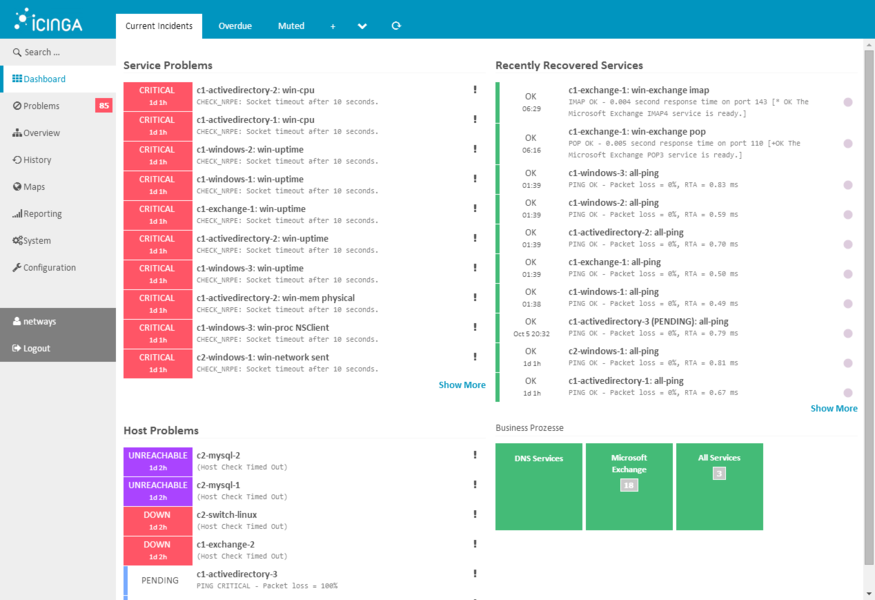

!SLIDE subsectionnonum
#~~~SECTION:MAJOR~~~.~~~SECTION:MINOR~~~ Icinga

!SLIDE smbullets
# Icinga
Icinga is an open source tool for active monitoring. It executes checks and evaluates results to trigger notifications or events. A spin-off product of these checks are performance data.

* Checks run periodically
* Checks can be
 * disk, load, memory, cpu, processes, ...
 * VMWare, Microsoft, Dell, HP, ...
 * MySQL, PostgreSQL, Apache2, NginX, ...
 * Many more
* Full compatibility to Nagios plugins

!SLIDE smbullets
# Forwarding Data

One of Icinga 2s key features is the forwarding of stuff. Nearly any data can be forwarded to one or multiple backends.

* Forward
 * Performance Data
 * Check results
 * Thresholds
 * Logs

* Forward to
 * **Graphite**
 * **OpenTSDB**
 * **InfluxDB**
 * Greylog (gelf)
 * Logstash (gelf)
 * PNP4Nagios (perfdata)

!SLIDE small smbullets
# Installation

There are repositories and packages for Icinga under http://packages.icinga.com

* Debian 
http://packages.icinga.com/debian
* Ubuntu 
ppa:formorer/icinga
* RedHat/CentOS 
http://packages.icinga.com/epel/ICINGA-release.repo
* Fedora 
http://packages.icinga.com/fedora/ICINGA-release.repo
* SLES 11 
http://packages.icinga.com/SUSE/ICINGA-release-11.repo
* SLES 12 
http://packages.icinga.com/SUSE/ICINGA-release.repo
* openSUSE 
http://packages.icinga.com/openSUSE/ICINGA-release.repo

!SLIDE small smbullets noprint
# Training Environment

One of your training virtual machines already includes the following installation:

* Icinga 2
 * Monitoring plugins
 * IDO support (MariaDB Database)
* Icinga Web 2

!SLIDE small smbullets printonly
# Training Environment

One of your training virtual machines already includes the following installation:

* Icinga 2
 * Monitoring plugins
 * IDO support (MariaDB Database)
* Icinga Web 2

!SLIDE smbullets
# Icinga Web 2

Icinga Web 2 is a webinterface for Icinga. You can view the current state of your services and check out historical data.

* Create dashboards
* Current and historical states of services
* Groups
* Contacts
* Acknowledge problems
* Set downtimes
* Comments
* Reschedule checks
* Reporting

!SLIDE noprint
# Icinga Web 2

Icinga Web 2 is available on "graphing1.localdomain" under "/icingaweb2" with user "icingaadmin" and password "icinga".

!SLIDE printonly
# Icinga Web 2

Icinga Web 2 is available on "graphing1.localdomain" under "/icingaweb2" with user "icingaadmin" and password "icinga".

!SLIDE small
# Icinga 2 Graphite Feature

Every part of Icinga 2 is a module, also called feature. To add Graphite support to Icinga 2 you need to enable and configure the proper feature.

    @@@Sh 
    # icinga2 feature list
    # icinga2 feature enable graphite

Edit `/etc/icinga2/features-enabled/graphite.conf`. The target host can be either Graphite or InfluxDB with Graphite input plugin.

    @@@Sh
    object GraphiteWriter "graphite" {
      host = "127.0.0.1"
      port = 2003

      enable_send_thresholds = true // required
      enable_send_metadata = true // optional
    }

Validate and start Icinga 2:

    @@@Sh
    # icinga2 daemon -C
    # systemctl start icinga2.service

!SLIDE small
# Icinga 2 Storage Schema

Icinga 2 provides a storage schema with use for Graphite. Keep in mind that storage schemas are applied from the top to the bottom and the first match wins. How your storage schema looks like depends on your check intervals. By default the check interval is set to 1 minute.

    @@@Sh
    ...

    [icinga2_internals]
    pattern = ^icinga2\..*\.metadata\.
    retentions = 1m:7d
    
    [icinga2_default]
    pattern = ^icinga2\.
    retentions = 1m:2d,5m:10d,30m:90d,360m:4y

    ...

!SLIDE small
# Add a Host

For testing purposes you can add any host to your Icinga 2 configuration. The `ping` check is appropriate for testing the Graphite feature and is enabled by default on each host.

Edit `/etc/icinga2/conf.d/hosts.conf` and add a new host:

    @@@Sh
    object Host "netways.de" {
      import "generic-host"
      address = "netways.de"
    }

After configuration changes Icinga 2 needs to be reloaded

    @@@Sh
    # systemctl reload icinga2.service

!SLIDE noprint
# Graphing

Many of the Icinga plugins provide configured thresholds in addition to the performance counters. This is very usefull when creating graphs using this data.

With graphs that also show thresholds one can see occuring problems on first sight.

!SLIDE printonly
# Graphing

Many of the Icinga plugins provide configured threshold in addition to the performance counters. This is very useful when creating graphs using this data.

With graphs that show thresholds one can see occuring problems on first sight.

!SLIDE noprint
# Modules for Icinga Web 2

Icinga Web 2 can be extended with so called "modules". There are some modules available for the integration of Graphite and Grafana.

Here's a screenshot of the current state of the Grafana module:

!SLIDE printonly
# Modules for Icinga Web 2

Icinga Web 2 can be extended with so called "modules". There are some modules available for the integration of Graphite and Grafana.

Here's a screenshot of the current state of the Grafana module:

!SLIDE small
# Grafana Module for Icinga Web 2

The best module for Grafana is provided from GitHub user "mikesch-mp" and can be installed via git:

    @@@Sh
    # cd /usr/share/icingaweb2/modules/
    # git clone https://github.com/Mikesch-mp/\
    icingaweb2-module-grafana.git grafana

It must be explicitly enabled and needs a directory to store its configuration:

    @@@Sh
    # icingacli module enable grafana
    # mkdir /etc/icingaweb2/modules/grafana
    # chown apache:icingaweb2 /etc/icingaweb2/modules/grafana

~~~SECTION:handouts~~~

****

Project: https://github.com/Mikesch-mp/icingaweb2-module-grafana

~~~ENDSECTION~~~

!SLIDE small
# Configuration of Grafana Module

The Grafana module provides two default dashboards `base-metrics.json` and `icinga2-default.json` which have to be imported into Grafana.

After that Icinga Web 2 needs a configuration in order to use Grafana as backend for the module in `/etc/icingaweb2/modules/grafana/config.ini`:

    @@@Sh
    [grafana]
    host = 192.168.56.101:3000
    datasource = "graphite"
    username = "admin"
    password = "admin"
    accessmode = "proxy" 

!SLIDE smbullets
# Graph Monitoring

Icinga can be used to monitor nearly anything. It goes without saying that there is a way you can monitor also your graphs with it.

* `check_graphite` to check graphs
* Set any metric path
* Set thresholds
* Set timeframe
* Apply function on target metric

Note: The `check_graphite` plugin and its dependency `rubygem-rest-client` are already pre-installed on `graphing1.localdomain`.

To suppress Ruby warnings you should set '`$VERBOSE = nil`' in the `check_graphite` plugin on newer operating systems.

~~~SECTION:handouts~~~

****

Project: https://github.com/obfuscurity/nagios-scripts 
Docs: http://obfuscurity.com/2012/05/Polling-Graphite-with-Nagios

~~~ENDSECTION~~~

!SLIDE small smbullets
# Graph Monitoring

Add a new service to one of your hosts to check the load of a server in `/etc/icinga2/conf.d/services.conf`. Ideally the datapoints you are checking do not come from Icinga itself. The CheckCommand for the `check_graphite` plugin is preconfigured on your training environment.

    @@@Sh
    apply Service "graphite-load" {
      import "generic-service"
    
      check_command = "graphite"
    
      vars.graphite_url = "http://graphite"
      vars.graphite_metric = "collectd.graphing1.load.
        load.shortterm"
      vars.graphite_warning = 1
      vars.graphite_critical = 2
      vars.graphite_duration = 5
    
      assign where host.name == "graphing1.localdomain"
    }

Icinga 2 needs a reload:

    @@@Sh
    # systemctl reload icinga2.service
