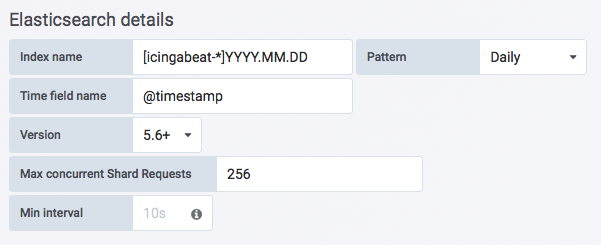
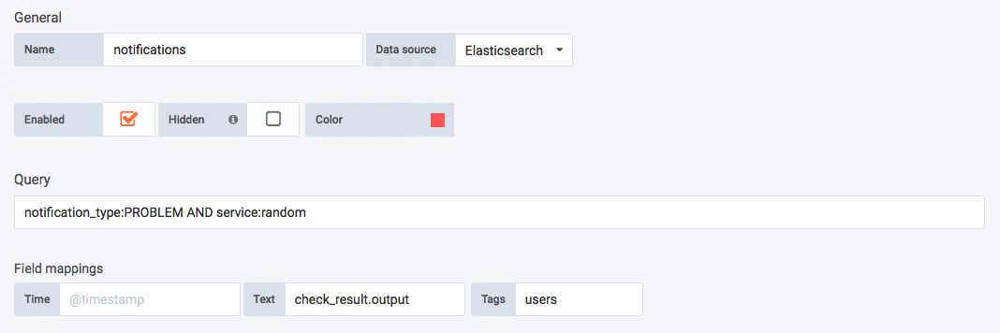

!SLIDE subsectionnonum
#~~~SECTION:MAJOR~~~.~~~SECTION:MINOR~~~ Icingabeat

!SLIDE small noprint
# Icingabeat

Icingabeat is an Elastic Beat that fetches data from the Icinga 2 API and sends it either directly to Elasticsearch or Logstash. There are also example dashboards for Kibana available.

**Note:** Icingabeat, Elasticsearch and Kibana are already pre-installed on "graphing1.localdomain".

!SLIDE small printonly
# Icingabeat

Icingabeat is an Elastic Beat that fetches data from the Icinga 2 API and sends it either directly to Elasticsearch or Logstash. There are also example dashboards for Kibana available.

**Note:** Icingabeat, Elasticsearch and Kibana are already pre-installed on "graphing1.localdomain".

~~~SECTION:handouts~~~

****

Project: https://github.com/Icinga/icingabeat

~~~ENDSECTION~~~

!SLIDE
# Event Streams

Icingabeat is pre-configured by default to receive check results (CheckResult) and state changes (StateChange) from Icinga's event stream and send them periodically (every 10s) to Elasticsearch.

Notifications, acknowledgements, comments and downtimes are also available as event streams. We add notifications (Notification) as event stream in our training environment and we have to turn off ssl verification:

File: **/etc/icingabeat/icingabeat.yml**

    @@@Sh
    ...

    ssl.verify: false

    eventstream.types:
     - CheckResult
     - StateChange
     - Notification

    ...

!SLIDE
# Start Elasticsearch and Icingabeat

Finally we can start Elasticsearch and Icingabeat:

    @@@Sh
    # systemd start elasticsearch.service
    # systemd start icingabeat.service

**Note:** If you're interested you can also start Kibana, it will be available at: http://192.168.56.101:5601

    @@@Sh
    # systemd start kibana.service

!SLIDE noprint
# Grafana Elasticsearch Data Source

Add the Elasticsearch data source with the Icingabeat index "**[icingabeat-*]**" to Grafana:

!SLIDE printonly
# Grafana Elasticsearch Data Source

Add the Elasticsearch data source with the Icingabeat index "**[icingabeat-*]**" to Grafana:

!SLIDE noprint
# Notification Annotations

Create a new graph with **icinga2.training_localdomain.services.random.
random.metadata.state** metrics from Graphite and annotation settings from Elasticsearch:

!SLIDE printonly
# Notification Annotations

Create a new graph with **icinga2.training_localdomain.services.random.
random.metadata.state** metrics from Graphite and annotation settings from Elasticsearch:

!SLIDE noprint
# Graph with Annotations

The graph should look similar like this one:

!SLIDE printonly
# Graph with Annotations

The graph should look similar like this one:

