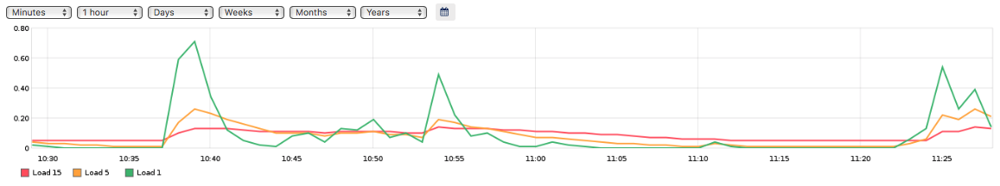

!SLIDE subsectionnonum
#~~~SECTION:MAJOR~~~.~~~SECTION:MINOR~~~ Web Modules

!SLIDE
# Modules for Icinga Web 2

Icinga Web 2 can be extended with so called *modules*. There are some modules available for the integration of Graphite and Grafana.

!SLIDE noprint
# Graphite Module

The Graphite module provided from the Icinga project integrates the graphs directly into the Icinga Web 2 interface:

!SLIDE printonly
# Graphite Module

The Graphite module provided from the Icinga project integrates the graphs directly into the Icinga Web 2 interface:

~~~SECTION:handouts~~~

****

Project: https://github.com/icinga/icingaweb2-module-graphite

~~~ENDSECTION~~~

!SLIDE
# Graphite Module Installation

The Graphite module can be installed via git:

    @@@Sh
    # git clone https://github.com/Icinga/\
    icingaweb2-module-graphite.git \
    /usr/share/icingaweb2/modules/graphite

    # cd /usr/share/icingaweb2/modules/graphite/
    # git checkout v1.0.1

After that the module must be enabled and adapted to the environment:

    @@@Sh
    # icingacli module enable graphite

File: **/etc/icingaweb2/modules/graphite/config.ini**

    @@@Sh
    [graphite]
    url = "http://graphite"
    insecure = "1"

!SLIDE noprint
# Grafana Module

An Icinga Web 2 module that retrieves graphs from Grafana is provided from GitHub user "mikesch-mp":

!SLIDE printonly
# Grafana Module

An Icinga Web 2 module that retrieves graphs from Grafana is provided from GitHub user "mikesch-mp":

~~~SECTION:handouts~~~

****

Project: https://github.com/Mikesch-mp/icingaweb2-module-grafana

~~~ENDSECTION~~~

!SLIDE
# Grafana Module Configuration

The Grafana module provides two default dashboards `base-metrics.json` and `icinga2-default.json` which have to be imported into Grafana.

After that Icinga Web 2 needs a configuration in order to use Grafana as backend for the module in **/etc/icingaweb2/modules/grafana/config.ini**:

    @@@Sh
    [grafana]
    host = 192.168.56.101:3000
    datasource = "graphite"
    username = "admin"
    password = "admin"
    accessmode = "proxy"
