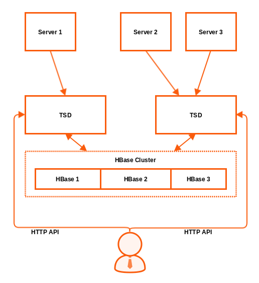

!SLIDE
# OpenTSDB

* Time series database
* Scalable
* Distributed
* HTTP API
* No rendering of data
* No collection of data
* Based on HBase
* Language: Java

~~~SECTION:handouts~~~
****

Project: http://opentsdb.net 
Docs: http://opentsdb.net/docs/build/html

~~~ENDSECTION~~~

!SLIDE
# OpenTSDB

OpenTSDB is a time series database based on Apaches HBase. With this underlying technology it is possible to distribute and scale data across a big amount of servers.

* Time Series Daemon (TSD)
 * One or multiple daemons that talk to HBase
 * TSDs are independent from each other
* HTTP API
 * User do not need to talk to HBase
* Telnet interface
* Simple built-in GUI
* Commandline Tools

~~~SECTION:handouts~~~
****

Project: http://opentsdb.net 
Docs: http://opentsdb.net/docs/build/html 
HBase: http://hbase.apache.org

~~~ENDSECTION~~~

!SLIDE noprint
# OpenTSDB Concept

!SLIDE printonly
# OpenTSDB Concept

!SLIDE
# OpenTSDB Metrics

OpenTSDB uses some kind of Graphites metric path combined with tags to identify datapoints:

    @@@Sh
    <metric> <timestamp> <value> <tagk1=tagv1 ... tagkN=tagvN>
    sys.cpu.user 1356998400 42.5 host=webserver01 cpu=0

!SLIDE
# OpenTSDB Collectors

To collect data several clients are available:

* TCollector 
http://opentsdb.net/docs/build/html/user_guide/utilities/tcollector.html
* SCollector (API v2) 
http://bosun.org/scollector/
* collectd 
https://github.com/auxesis/collectd-opentsdb
* Icinga 2 
https://www.icinga.com

!SLIDE
# OpenTSDB Client Libraries

For communication with OpenTSDB multiple client libraries exist. Some of them can just pull data where other may read and write metrics.

* R (read) 
* Erlang (write)
* Ruby (read/write)
* Go (read/write) 
* Python (write)
* vert.x (write)

!SLIDE
# OpenTSDB Frontends

Beside the simple built-in GUI there are some other webinterfaces for OpenTSDB dashboards:

* Grafana 
http://grafana.org

* TSDash 
https://github.com/facebookarchive/tsdash

* OpenTSDB Dashboard 
https://github.com/turn/opentsdb-dashboard

* Status Wolf 
https://github.com/box/StatusWolf

* Metrilyx 
https://github.com/Ticketmaster/metrilyx-2.0
