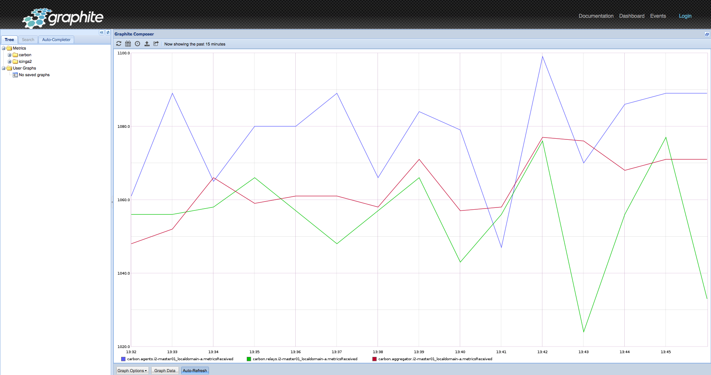

!SLIDE noprint
# Graphite-Web

!SLIDE printonly
# Graphite-Web

!SLIDE small smbullets
# Graphite-Web

Graphite-Web is the visualization component of the Graphite stack. It consists mainly of 3 parts:

**Composer**

The composer is the first thing you see when opening Graphites web application. It enables you to browse through your metrics and display those. Multiple graph options can change the look and feel of graphs. For permanent usage templates can be stored (**graphTemplates.conf**) and applied to graphs. With plenty of functions you can combine, transform, calculate or filter datapoints. This functionality, which is also available for the API, makes Graphite-Web to one of the most powerful webinterfaces for graph visualization.

**Dashboard**

The dashboard brings the same functionality as the composer, but combines multiple graphs to one overview. When logged in, users can save dashboards for later usage. The behaviour of the dashboard can be adjusted in **dashboard.conf**.

**API**

Using the API you can retrieve data in different formats. This can be used for integration into third party tools or monitoring purposes. The API represents almost the same functionality as the composer.

!SLIDE small smbullets
# Indexing

For faster access to metrics Graphite supports an index. This index is actually just a text file that includes all available metrics. It can be generated by a cronjob periodically.

Content of **/opt/graphite/storage/index**:

    @@@Sh
    ...
    collectd.graphing1.cpu-0.cpu-wait.value
    collectd.graphing1.cpu-0.cpu-user.value
    collectd.graphing1.interface-lo.if_packets.rx
    collectd.graphing1.interface-lo.if_packets.tx
    collectd.graphing1.interface-lo.if_octets.tx
    collectd.graphing1.interface-lo.if_octets.rx
    ...

An optional cronjob that creates the index each hour may look like this:

    @@@Sh
    0 * * * * /opt/graphite/bin/build-index.sh > /dev/null
